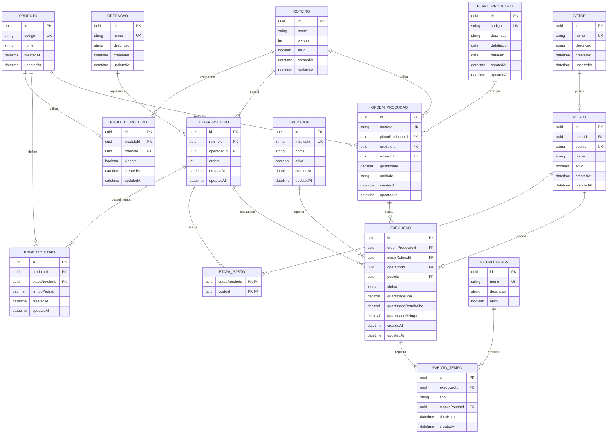

# Banco de dados

Material de apoio da etapa de banco de dados (06/10/2026). O modelo oficial é o contrato do Prisma em `src/prisma/contract.prisma`; os arquivos desta pasta são gerados a partir dele.

| Arquivo | Conteúdo |
| --- | --- |
| `schema.sql` | Script SQL de criação do banco: 15 tabelas, chaves primárias, restrições de unicidade, índices e 18 chaves estrangeiras. |
| `diagrama-er.png` | Diagrama entidade-relacionamento em imagem. |

## Como criar o banco pelo script

Em um banco PostgreSQL vazio:

```bash
psql "$DATABASE_URL" -f docs/database/schema.sql
```

O script reúne os mesmos comandos da migração `migrations/app/20261006T1821_init`, na mesma ordem. No dia a dia, o banco é criado pela migração do Prisma; o script serve para consulta e para criar o banco manualmente.

## Diagrama entidade-relacionamento


