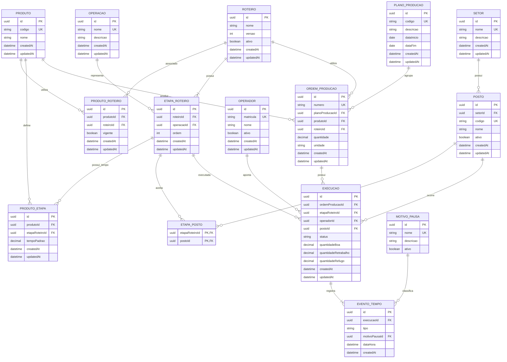

# Modelo de banco do MVP

Versão de trabalho 2 — 06/10/2026. Substitui a proposta de 04/10/2026 (Linha, OrdemServico, Ficha, FichaEtapa, PlanoPosto), que deixa de valer.

Este documento descreve o modelo consolidado pela equipe em 06/10, depois das respostas do Ricardo sobre o processo da empresa. Ele separa três coisas:

- **Decisão:** o que está no diagrama e nas regras acordadas.
- **Recomendação:** restrição ou detalhe que o diagrama não define e que este documento sugere.
- **Em aberto:** ponto que precisa de resposta antes de implementar.

## O que mudou em relação à versão anterior

| Antes (04/10) | Agora |
| --- | --- |
| Ordem de Serviço com várias Fichas | Ficha e Ordem de Produção são o mesmo conceito: `ORDEM_PRODUCAO` |
| Baixas incrementais de quantidade | Não existe baixa parcial; a baixa é de 100% da ordem na etapa |
| Execução individual por operador | Execução é a passagem da ordem por uma etapa; o operador é só o responsável pelo apontamento |
| Roteiro como lista de operações do produto, copiado para a ficha | `ROTEIRO` versionado; a ordem referencia a versão usada |
| Tempo padrão na operação do produto | Tempo padrão em `PRODUTO_ETAPA` (produto + etapa do roteiro) |
| Linha → Posto | `SETOR` → `POSTO` |
| Intervalos de tempo gravados | Eventos (`EVENTO_TEMPO`); os intervalos são derivados |
| Plano com disponibilidade por posto | Fora do MVP; `PLANO_PRODUCAO` só agrupa ordens |
| Quantidade inteira em pares | Quantidade decimal com unidade, sem amarrar a um tipo de produto |

## Respostas do Ricardo que fundamentam o modelo

1. Ficha de Produção e Ordem de Produção são sinônimos. "Ficha" é o nome do documento físico.
2. A ficha representa uma quantidade definida de um único produto: é um lote físico. O mesmo produto pode estar em várias fichas.
3. Não é preciso controlar a execução individual por operador. Muitas atividades são feitas por células. O que importa é saber em qual etapa a ficha está e quando ocorreu a baixa.
4. O tempo padrão pertence a uma tarefa de uma etapa do processo e pode variar conforme o produto. O tempo de giro entre etapas (em dias) é outro conceito.
5. O posto está ligado a uma etapa do processo, não a uma pessoa, e os postos se organizam em setores.
6. Não existe baixa parcial: até a baixa, 100% da quantidade está pendente na etapa; na baixa, 100% é considerada produzida.

## Diagrama

## Entidades

Os campos são os do diagrama (decisão). A coluna "Restrições recomendadas" traz o que o diagrama não define.

| Entidade | Papel | Restrições recomendadas |
| --- | --- | --- |
| `PRODUTO` | Item fabricado. | — |
| `OPERACAO` | Atividade produtiva reutilizável. Não tem tempo padrão próprio. | — |
| `ROTEIRO` | Versão de um processo de fabricação. | Único: `(nome, versao)`. Roteiro já usado em ordem não é editado; cria-se nova versão. |
| `ETAPA_ROTEIRO` | Ocorrência de uma operação em um roteiro. | Único: `(roteiroId, ordem)`. |
| `PRODUTO_ROTEIRO` | Liga produto e roteiro e marca o vigente. | Único: `(produtoId, roteiroId)`. No máximo um `vigente` por produto (índice único parcial). |
| `PRODUTO_ETAPA` | Tempo padrão da etapa para o produto. | Único: `(produtoId, etapaRoteiroId)`. `tempoPadrao` maior que zero; ausência é pendência, nunca zero. |
| `PLANO_PRODUCAO` | Agrupador de planejamento com período. | `dataFim` não anterior a `dataInicio`. |
| `ORDEM_PRODUCAO` | A ficha: lote de um único produto. | `quantidade` maior que zero. O roteiro precisa estar associado ao produto (validação na aplicação). |
| `OPERADOR` | Responsável pelo apontamento. | — |
| `SETOR` | Organiza os postos. | — |
| `POSTO` | Local ou recurso produtivo. | — |
| `ETAPA_POSTO` | Postos em que a etapa pode ser feita. | — |
| `EXECUCAO` | Passagem de uma ordem por uma etapa. | Ver regras abaixo. |
| `EVENTO_TEMPO` | Início, pausa, retomada e finalização. | Ver regras abaixo. |
| `MOTIVO_PAUSA` | Classificação padronizada das pausas. | — |

## Regras de negócio (decisão)

### Ordem e quantidade

- Uma ordem representa uma quantidade de um único produto.
- Não existe baixa parcial nem registro incremental de quantidade.
- A baixa considera 100% da quantidade da ordem na etapa.
- O resultado da baixa se divide em boa, retrabalho e refugo, e `boa + retrabalho + refugo = quantidade da ordem`.
- A ordem guarda a versão do roteiro usada. Mudar o roteiro vigente do produto não altera ordens já criadas.

### Execução

- Estados: `EM_EXECUCAO`, `PAUSADA`, `FINALIZADA`. Não há estado "não iniciada" gravado; a ausência de execução é que indica isso.
- Transições: `EM_EXECUCAO → PAUSADA`, `PAUSADA → EM_EXECUCAO`, `EM_EXECUCAO → FINALIZADA`.
- Execução finalizada é terminal e não recebe novos eventos.
- Uma ordem pode ter várias execuções, inclusive para a mesma etapa, mas a baixa efetiva de uma etapa ocorre uma única vez.
- Um operador não mantém duas execuções abertas ao mesmo tempo; execução pausada continua contando como aberta.
- Trocar de operação finaliza a execução atual e cria outra.
- O operador é o responsável pelo apontamento, não necessariamente o único trabalhador da célula.

### Tempo

- Cada execução tem um `INICIO` e uma `FINALIZACAO`, e pode ter várias `PAUSA` e `RETOMADA`.
- Toda `PAUSA` tem um motivo.
- O tempo produtivo é derivado dos intervalos ativos. Ausência de evento não é ociosidade.

### Posto e roteiro

- Uma etapa pode ser feita em vários postos compatíveis; um posto recebe várias execuções ao longo do tempo.
- Posto e recurso são a mesma entidade no MVP.
- A sequência das etapas é só nominal: não há dependência, bloqueio ou liberação automática entre etapas.

## Restrições recomendadas para execução e eventos

Estas não estão no diagrama, mas decorrem das regras acima e do `ARCHITECTURE.md`.

- **Uma execução aberta por operador, garantida no banco:** índice único parcial em `operadorId` para `status` diferente de `FINALIZADA`.
- **Quantidades só na baixa:** os três campos ficam nulos até a finalização que dá a baixa.
- **Soma conferida:** `boa + retrabalho + refugo = ORDEM_PRODUCAO.quantidade`, validado na transação da baixa.
- **Uma baixa por ordem e etapa:** no máximo uma execução com quantidades preenchidas por `(ordemProducaoId, etapaRoteiroId)`.
- **Etapa do roteiro certo:** `etapaRoteiroId` pertence ao roteiro da ordem.
- **Posto compatível:** `postoId` consta em `ETAPA_POSTO` para a etapa.
- **Motivo só em pausa:** `motivoPausaId` obrigatório quando `tipo = PAUSA` e nulo nos demais.
- **Eventos em ordem:** o evento novo não pode ter `dataHora` anterior ao último evento da execução.
- **`status` e `tipo` como enum**, não texto livre.
- **Transação** em toda mudança de estado: o evento e o novo `status` são gravados juntos.

## Em aberto

1. **Unidade do tempo padrão.** `tempoPadrao` é decimal, sem unidade definida. Segundos por unidade produzida? Os indicadores dependem disso.
2. **Várias execuções na mesma etapa.** Se só uma dá a baixa, o que as outras registram? Ficam com as quantidades nulas?
3. **Proteção contra reenvio.** O `ARCHITECTURE.md` exige que duplo clique ou reenvio não dupliquem evento nem baixa. O diagrama não tem identificador de solicitação em `EXECUCAO` nem em `EVENTO_TEMPO`.
4. **Usuário e permissões.** Não há tabela de usuário. Fica por conta da solução de autenticação?
5. **Correções.** Não há histórico de correção de apontamento. Como se corrige uma baixa errada?
6. **Plano obrigatório.** Toda ordem precisa de um plano de produção, ou `planoProducaoId` pode ser nulo?
7. **Inativação.** `PRODUTO`, `OPERACAO` e `SETOR` não têm `ativo`. Cadastros usados em ordens não podem ser apagados; como serão desativados?
8. **Categoria do motivo de pausa.** `MOTIVO_PAUSA` só tem nome. Sem uma categoria, o painel não separa pausa prevista de interrupção.
9. **Linha de produção.** Não existe entidade de linha; o setor é o nível mais alto. Com mais de uma linha, será preciso um agrupador.

## Fora do MVP

Dependências entre etapas; otimização automática; sensores e integração com máquinas; controle de todos os operadores de uma célula; capacidade e disponibilidade de postos; tempo de giro entre etapas e previsão de datas; QR Code e código de barras; permissões granulares; pedidos de venda; fluxo separado de retrabalho; componentes reutilizáveis com tempo padrão próprio.

## Diferença para o schema Prisma já publicado

A branch `adicionar-sistema-producao` (05/10) implementa a fase 1 da proposta anterior em `sistema-producao/prisma/schema.prisma`. Ela precisa ser migrada para este modelo.

| No schema publicado | Neste modelo |
| --- | --- |
| `Linha` | Sai; entra `SETOR` |
| `Posto` com `linhaId` | `POSTO` com `setorId` |
| `Produto` | `PRODUTO` (sem `descricao` e `ativo` no diagrama) |
| `Operacao` com `codigo` | `OPERACAO` (só `nome` único) |
| `OperacaoProduto` (produto, operação, posto, sequência, tempo) | Divide-se em `ROTEIRO`, `ETAPA_ROTEIRO`, `PRODUTO_ROTEIRO`, `PRODUTO_ETAPA` e `ETAPA_POSTO` |
| `OrdemServico` e `Ficha` | Uma só entidade: `ORDEM_PRODUCAO` |
| `FichaEtapa` com cópia de operação, posto e tempo | Sai; a ordem aponta para a versão do roteiro |
| `StatusProducao` em ordem, ficha e etapa | Sai; a situação é derivada das execuções |
| Chaves `Int` com autoincremento | Chaves `uuid` |
| `quantidade` inteira | `quantidade` decimal com `unidade` |
| — | Novas: `PLANO_PRODUCAO`, `OPERADOR`, `EXECUCAO`, `EVENTO_TEMPO`, `MOTIVO_PAUSA` |

O projeto do schema está em uma pasta separada (`sistema-producao/`), fora da aplicação Next.js. A integração das duas partes é uma decisão do Arthur.
